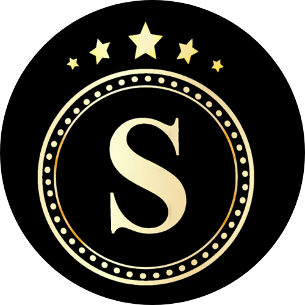

# BarberShop
> Barbearia Savio

Sistema de controle de uma Barbearia, na qual o usuário poderá agendar um serviço
de corte.

## Tecnologias / Frameworks
<ul>
  <li><b>Arquitetura Hexagonal</b></li>
  <li>Spring Boot</li>
  <li>MongoDB</li>
  <li>API Rest</li>
</ul>

## Informações Adicionais
> Esse projeto foi desenvolido para disciplina de Linguagem de Programação II (LPII)
    , Professor __Thiago Felippe de Lima Bandeira__, Curso de __Bacharel em Ciencia da Computação__, IFCE campus Aracati.
    Desenvolvido por Erisnilton Freitas || Lidiane Gomes.

